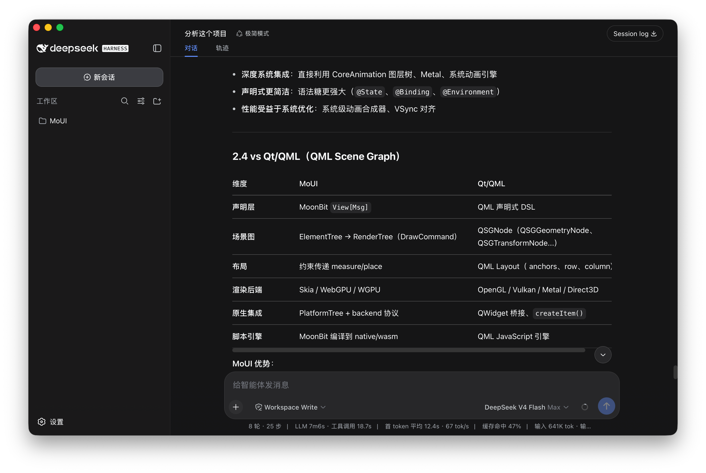

# DeepSeek Harness Desktop

[](https://github.com/moui-mbt/deepseek-harness-desktop/actions/workflows/ci.yml)
[](https://github.com/moui-mbt/deepseek-harness-desktop/actions/workflows/release.yml)

Standalone native [MoUI](https://github.com/wzzc-dev/MoUI) desktop shell for [DeepSeek Harness](https://github.com/deepseek-ai). Extracted from `examples/deepseek_harness_desktop` in the MoUI monorepo.

DSH owns the product UI and state; this app embeds the local Harness and DeepSeek Chat surfaces in controlled `moui_webview` platform views and reports a clear fallback when the native WebView is unavailable.

The retained app lives in `app/`; the macOS, Windows, and Linux entrypoints only assemble their native WebView plugin, Skia renderer, and native host.

Implementation notes live in [docs/](docs/README.md).



## Prerequisites

- [MoonBit toolchain](https://www.moonbitlang.com/download/) (`moon` >= 0.1.8)
- The `dsh` CLI installed on `PATH` or in a common user/system binary directory
- Platform WebView dependencies:
  - **macOS**: Xcode and WebKit (bundled)
  - **Windows**: WebView2 runtime
  - **Linux**: WebKitGTK native dependencies (`libwebkit2gtk-4.1-dev`, `libsoup`, etc.)

## Run

```sh
# macOS
moon run macos_skia --target native

# Windows
moon run windows_skia --target native

# Linux
moon run linux_skia --target native
```

The default surface is `http://127.0.0.1:3080`, matching a local DSH host. On launch the app checks that endpoint. If it is not running, use **DSH → 启动 DSH Web**; the native host resolves the installed `dsh` executable, launches `dsh web` for the configured local host and port, and waits for the TCP endpoint before navigating. The app does not duplicate DSH navigation, sessions, profiles, settings, or terminal UI.

### macOS 首次安装

Release 产物未经 Apple 公证，首次打开会被 Gatekeeper 拦截（"已损坏，无法打开" 或 "无法验证开发者"）。安装后需移除 quarantine 属性：

```sh
sudo xattr -dr com.apple.quarantine "/Applications/DSH Desktop.app"
```

之后再启动即可正常运行。

All three composition roots use the Skia provider route. `MOUI_SKIA_RENDERER` selects `auto` (the default), `skia-gpu`, or `skia-raster`; auto prefers the native GPU surface and falls back to Skia raster. When native WebView is unavailable, the app shows its capability fallback instead of embedding a substitute surface.

## Configuration

Use `Settings…` in the standard macOS application menu, or press `Cmd+,`, to change the DSH root URLs and appearance. The Theme control offers `System`, `Dark`, and `Light`; it is persisted as `dsh-desktop/theme-mode` and drives both the MoUI surface and the native WebView background. The native URL settings accept trimmed `http://` and `https://` URLs, persist through `NSUserDefaults`, and apply only after persistence succeeds. Saving the current URL only closes the dialog; it does not reload the WebView.

On macOS, the settings dialog is a MoUI modal above the full-window WKWebView. While it is open, the active Skia presenter moves above the WebView, uses a transparent frame clear, and the WebView excludes the full overlay bounds from hit testing. Skia auto mode tries the GPU surface first and falls back to the CPU raster presenter when GPU setup is unavailable. Closing the dialog restores the WebView as the front sibling and restores its input.

The first 32 points of the WebView are also a drag/no-drag strip: blank space moves the native window, while links, buttons, inputs, editable controls, and elements marked `data-moui-no-drag` remain clickable. DSH can add that attribute to any custom interactive control in its top bar.

On macOS, the DSH shell explicitly reserves a top-right no-drag rectangle for the conversation header controls. It is supplied directly by the MoonBit WebView placement, so the click area does not depend on a page patch.

The menu bar adds a **DSH** menu with **启动 DSH Web** and **关闭 DSH Web**. Starting creates an owned native process through `moonbitlang/async@0.21.0`, polls the configured Harness endpoint for up to 10 seconds, then navigates only after it is ready. Stopping cancels and reaps that process before replacing the WebView with a lightweight placeholder. Closing the desktop app exits its root async `TaskGroup`, which also cancels and waits for every DSH process it started. A DSH server that was already running when the app opened is detected and can be used, but neither the stop action nor app shutdown terminates it because the app does not own that process. Both actions are available as typed `ProgramCommand`s so they can be triggered from the host menu or programmatically.

## Theming & Navigation

Harness and Chat use separate native WebViews. Chat starts loading in the background after settings are ready, while Harness navigates after the local DSH endpoint is ready. Switching sites only changes which retained WebView is visible, so returning to either site preserves its loaded page instead of starting another remote navigation. The resolved Theme background and native appearance are applied to both surfaces.

The floating button (brand blue) is hidden by default. Use **View → Toggle Floating Button** to show it; it toggles between Harness and Chat, can be dragged or docked to either edge (leaving a 16px peek tab), and opens Settings on a secondary tap.

The macOS composition root installs the versioned `dsh-shell` HostPatch (`v1.0.0`) before the first navigation and on every later configuration revision. Its stylesheet adjusts the expanded sidebar top inset, collapsed rail width, and related grid columns. The macOS traffic lights themselves are not resized. Windows and Linux use the shared app without this shell patch.

## Project Structure

```
.
├── app/              # Platform-agnostic TEA program (Model/Msg/update/view)
│   ├── config.mbt
│   ├── model.mbt
│   ├── update.mbt
│   ├── view.mbt
│   ├── program.mbt
│   ├── runtime.mbt
│   ├── commands.mbt
│   └── dsh_async/     # Native async DSH process/probe implementation
├── docs/             # DSH Desktop implementation and lifecycle notes
├── macos_skia/       # macOS composition root (WKWebView + Skia)
│   ├── dsh_shell_patch.css/js  # Readable macOS WebView resources
│   └── dsh_shell_patch.mbt     # HostPatch + top no-drag policy
├── linux_skia/       # Linux composition root (WebKitGTK + Skia)
├── windows_skia/     # Windows composition root (WebView2 + Skia raster)
├── moon.mod          # Module manifest (deepseek_harness_desktop)
└── README.md
```

## Test

```sh
moon test app --target native
moon test app/dsh_async --target native
moon check macos_skia --target native
moon check linux_skia --target native
moon check windows_skia --target native
```

## CI & Packaging

GitHub Actions 自动构建三平台原生包并在打标签时发布 Release：

- **CI** (`.github/workflows/ci.yml`)：PR 与 `main` 推送触发
  - `check` (ubuntu)：`moon fmt --check` / `moon check --target native` / `moon test --target native`
  - `build` 矩阵：`macos-14` → `macos_skia` / `ubuntu-24.04` → `linux_skia` / `windows-2022` → `windows_skia`
    - 安装平台依赖（Linux: `libwebkit2gtk-4.1-dev` + `libsoup-3.0-dev` + Wayland/Skia；macOS: Xcode；Windows: WebView2）
    - `moon build <package> --target native --release`
    - 调用 `scripts/package-*.sh` 生成可分发产物并 `upload-artifact`
- **Release** (`.github/workflows/release.yml`)：`git tag v*` 或手工 `workflow_dispatch`
  - 同矩阵构建 `--release`，产物重命名为 `DSH-Desktop-<version>-<platform>.*`
  - 自动生成 `SHA256SUMS.txt` 并通过 `softprops/action-gh-release` 发布

本地复刻 CI 打包：

```sh
# macOS
bash scripts/package-macos.sh --package macos_skia --version 0.1.0 --release
# 会产生 dist/macos/DSH Desktop.app + dist/DSH-Desktop-0.1.0-macOS.zip (+ .dmg 需 hdiutil)

# Linux
bash scripts/package-linux.sh --package linux_skia --version 0.1.0 --release
# 产生 dist/DSH-Desktop-0.1.0-linux-x64.tar.gz (+ .deb 需 dpkg-deb)

# Windows (PowerShell)
pwsh scripts/package-windows.ps1 -Package windows_skia -Version 0.1.0 -Release
# 产生 dist/DSH-Desktop-0.1.0-windows-x64.zip (+ Inno Setup 安装包需 iscc)

# 快速验证（不重新编译，直接打包已有 _build 产物）
bash scripts/package-macos.sh --no-build --version 0.1.0 --build-version 99
```

## Origin

This repository was extracted via `git subtree split -P examples/deepseek_harness_desktop` from [wzzc-dev/MoUI](https://github.com/wzzc-dev/MoUI). History is preserved with `LICENSE` as the root commit.

Upstream path: `examples/deepseek_harness_desktop/` in MoUI monorepo.

## License

Apache-2.0, see [LICENSE](./LICENSE).
